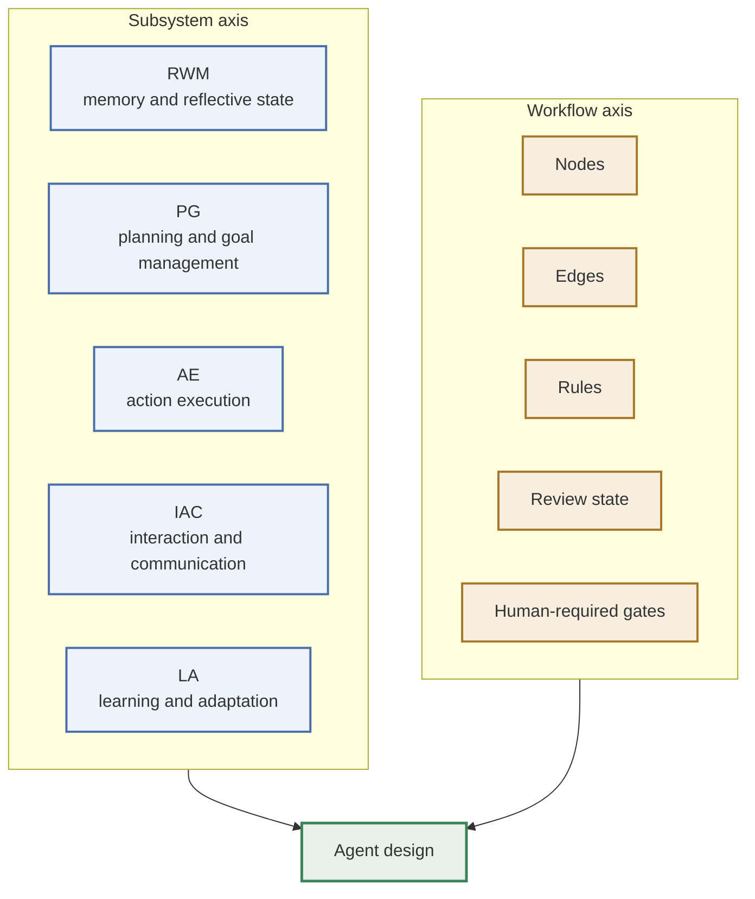
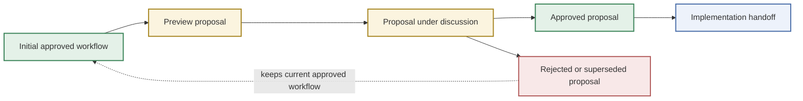
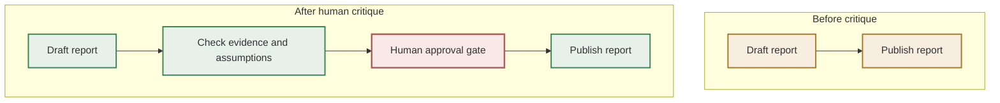
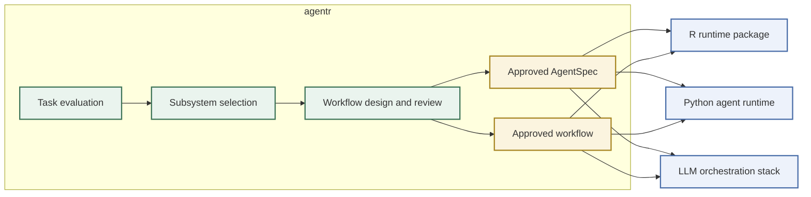

# Conceptual Figures

These figures summarize the core design ideas behind `agentr` as of `0.2.3`.

## Figure 1. From Human Workflow To Agentic Workflow

This figure shows the transitional scaffolding story: a human starts with an ad hoc workflow, `Scaffolder` turns it into an explicit reviewed design artifact, and only then does implementation move into an agentic stack.

```mermaid
flowchart LR
    classDef human fill:#f7f1e8,stroke:#9a6735,stroke-width:2px;
    classDef scaffold fill:#eaf4ee,stroke:#3f7559,stroke-width:2px;
    classDef proposal fill:#fbf4df,stroke:#a78622,stroke-width:2px;
    classDef approved fill:#e4f1e8,stroke:#3b8459,stroke-width:2px;
    classDef runtime fill:#edf2fb,stroke:#4a6ea9,stroke-width:2px;

    A[Human task and ad hoc workflow] --> B[Scaffolder evaluation and decomposition]
    B --> C[Workflow proposal preview]
    C --> D[Human critique and refinement]
    D --> E[Approved workflow plus agent design]
    E --> F[Implementation handoff to coding or runtime stack]

    class A,D human;
    class B scaffold;
    class C proposal;
    class E approved;
    class F runtime;
```

## Figure 2. Two-Axis Design Model

`agentr` keeps subsystem design separate from workflow design. Subsystems define what kind of agent is needed; workflow defines how work is organized and reviewed.

## Figure 3. Proposal Lifecycle

The approved workflow remains stable until a proposal is explicitly accepted.

## Figure 4. Before And After Refinement Example

Human critique should make the workflow more realistic, not just longer.

## Figure 5. Portability Of Approved Design Artifacts

`agentr` is the scaffolding environment. The approved artifacts should remain portable to other implementation stacks.

